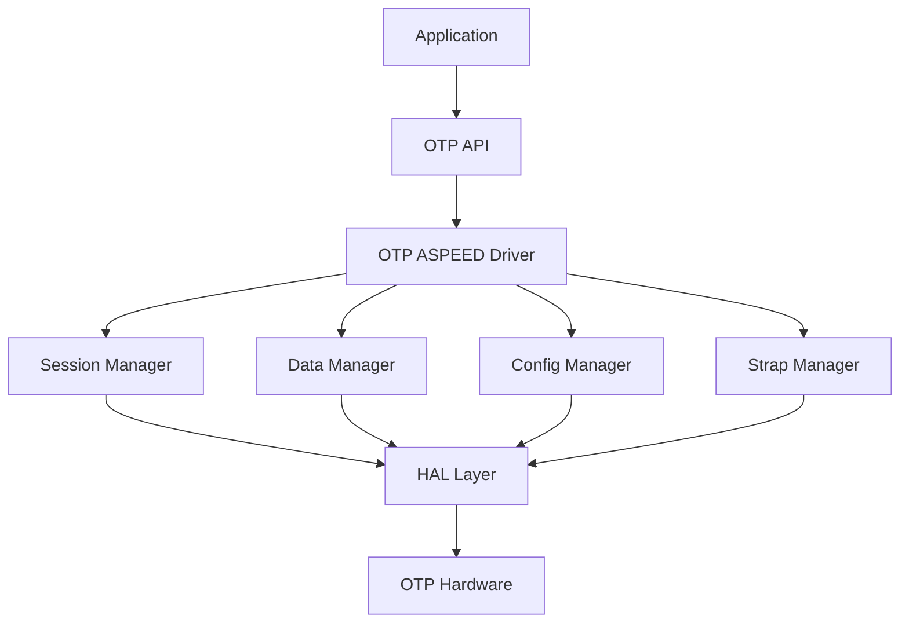

# OTP ASPEED Driver Design Document

## Table of Contents
1. [Overview](#overview)
2. [Architecture](#architecture)
3. [Hardware Abstraction Layer](#hardware-abstraction-layer)
4. [Software Components](#software-components)
5. [API Design](#api-design)
6. [Data Structures](#data-structures)
7. [Memory Layout](#memory-layout)
8. [Security Features](#security-features)
9. [Device Tree Integration](#device-tree-integration)
10. [Error Handling](#error-handling)
11. [Testing Strategy](#testing-strategy)
12. [Future Enhancements](#future-enhancements)

## Overview

The OTP (One-Time Programmable) ASPEED driver provides a comprehensive abstraction layer for managing OTP memory in ASPEED System-on-Chip (SoC) devices. This driver supports multiple ASPEED chip variants including AST1030A0/A1, AST1035A1, and AST1060A1/A2, offering secure storage for configuration data, cryptographic keys, and strap settings.

### Purpose
- Provide secure, tamper-resistant storage for critical system configuration
- Support cryptographic key storage for secure boot and authentication
- Enable hardware-level configuration through strap programming
- Offer a unified API across different ASPEED SoC variants

### Key Features
- Multi-chip support (AST1030/1035/1060 series)
- Secure programming with verification and retry mechanisms
- Protection status monitoring and enforcement
- Device tree configuration support
- Comprehensive error handling and status reporting

## Architecture

### High-Level Architecture

```
┌─────────────────────────────────────────────────────────────┐
│                    Application Layer                        │
├─────────────────────────────────────────────────────────────┤
│                    Zephyr OTP API                          │
├─────────────────────────────────────────────────────────────┤
│                OTP ASPEED Driver Layer                     │
│  ┌─────────────┬─────────────┬─────────────┬─────────────┐  │
│  │   Session   │   Data      │   Config    │   Strap     │  │
│  │   Mgmt      │   Mgmt      │   Mgmt      │   Mgmt      │  │
│  └─────────────┴─────────────┴─────────────┴─────────────┘  │
├─────────────────────────────────────────────────────────────┤
│                Hardware Abstraction Layer                  │
│  ┌─────────────┬─────────────┬─────────────┬─────────────┐  │
│  │   Register  │   Security  │   Timing    │   Version   │  │
│  │   Access    │   Control   │   Control   │   Control   │  │
│  └─────────────┴─────────────┴─────────────┴─────────────┘  │
├─────────────────────────────────────────────────────────────┤
│                    ASPEED OTP Hardware                     │
└─────────────────────────────────────────────────────────────┘
```

### Component Interaction



## Hardware Abstraction Layer

### Register Interface
The driver provides a clean abstraction over OTP hardware registers:

```c
#define OTP_RD(reg)             sys_read32(otp_base + (reg))
#define OTP_WR(val, reg)        sys_write32(val, otp_base + (reg))
```

### Key Hardware Registers
- **OTP_PROTECT_KEY (0x0)**: Access protection control
- **OTP_COMMAND (0x4)**: Command execution register
- **OTP_TIMING (0x8)**: Programming timing control
- **OTP_ADDR (0x10)**: Target address for operations
- **OTP_STATUS (0x14)**: Operation status and completion
- **OTP_COMPARE_1-4 (0x20-0x2c)**: Data comparison registers

### Chip Version Detection
The driver automatically detects the target chip variant:

```c
static uint32_t chip_version(void)
{
    uint32_t revid0, revid1;
    
    revid0 = sys_read32(ASPEED_REVISION_ID0);
    revid1 = sys_read32(ASPEED_REVISION_ID1);
    
    // Version detection logic for AST1030/1035/1060 variants
}
```

## Software Components

### 1. Session Management
Provides controlled access to OTP operations with proper locking:

```c
// Session establishment
int aspeed_otp_session_setup(const struct device *dev, struct otp_info_cb *info_cb);

// Session cleanup
int aspeed_otp_session_free(const struct device *dev);
```

**Key Features:**
- Hardware unlock/lock mechanism
- Protection status validation
- Resource management

### 2. Data Management
Handles OTP data region operations (2048 double-words):

```c
// Read operations
int aspeed_otp_read_data(uint32_t offset, uint32_t *buf, uint32_t len);

// Write operations
int aspeed_otp_prog_data(uint32_t offset, uint32_t *buf, uint32_t len);
```

**Key Features:**
- Boundary checking (offset + len ≤ 2048)
- Alignment validation (offset % 4 == 0)
- Atomic programming with verification

### 3. Configuration Management
Manages OTP configuration region (32 double-words):

```c
// Configuration read/write
int aspeed_otp_read_conf(uint32_t offset, uint32_t *buf, uint32_t len);
int aspeed_otp_prog_conf(uint32_t offset, uint32_t *buf, uint32_t len);
```

**Key Features:**
- 32 DW configuration space
- Protection-aware operations
- Device tree integration

### 4. Strap Management
Controls hardware strap settings (64 bits):

```c
// Strap operations
int aspeed_otp_read_strap(uint32_t *buf);
int aspeed_otp_prog_strap_bit(uint32_t bit_offset, int value);
```

**Key Features:**
- Individual bit programming
- Remaining write attempts tracking
- Protection status monitoring

## API Design

### Core Driver API

```c
struct otp_driver_api {
    // Session management
    int (*begin_session)(const struct device *dev, struct otp_info_cb *info_cb);
    int (*free_session)(const struct device *dev);
    
    // Information retrieval
    int (*get_tool_ver)(const struct device *dev, char *otp_ver_str);
    int (*get_sw_rid)(const struct device *dev, uint32_t *sw_rid);
    int (*get_key_num)(const struct device *dev, uint32_t *key_num);
    int (*get_chip_rid)(const struct device *dev, uint32_t *revid);
    
    // Hardware control
    int (*set_soak)(const struct device *dev, int soak);
    int (*otp_read)(const struct device *dev, uint32_t otp_addr, uint32_t *data);
    int (*otp_program)(const struct device *dev, uint32_t otp_addr, uint32_t prog_bit);
};
```

### Export API Functions

```c
// High-level data operations
int aspeed_otp_read_data(uint32_t offset, uint32_t *buf, uint32_t len);
int aspeed_otp_prog_data(uint32_t offset, uint32_t *buf, uint32_t len);

// Configuration operations
int aspeed_otp_read_conf(uint32_t offset, uint32_t *buf, uint32_t len);
int aspeed_otp_prog_conf(uint32_t offset, uint32_t *buf, uint32_t len);

// Strap operations
int aspeed_otp_read_strap(uint32_t *buf);
int aspeed_otp_prog_strap_bit(uint32_t bit_offset, int value);

// Image programming
int aspeed_otp_prog_image(uint32_t addr);
```

## Data Structures

### 1. OTP Information Callback

```c
struct otp_info_cb {
    int version;                            // Chip version
    char ver_name[10];                      // Version string
    const struct otpstrap_info *strap_info; // Strap configuration
    int strap_info_len;
    const struct otpconf_info *conf_info;   // Config information
    int conf_info_len;
    const struct otpkey_type *key_info;     // Key type information
    int key_info_len;
    const struct scu_info *scu_info;        // SCU information
    int scu_info_len;
    struct otp_pro_sts pro_sts;             // Protection status
};
```

### 2. Protection Status

```c
struct otp_pro_sts {
    char mem_lock;      // Memory lock status
    char pro_key_ret;   // Key return protection
    char pro_strap;     // Strap protection
    char pro_conf;      // Configuration protection
    char pro_data;      // Data protection
    char pro_sec;       // Security region protection
    uint32_t sec_size;  // Security region size
};
```

### 3. Strap Status

```c
struct otpstrap_status {
    int value;              // Current strap value
    int option_array[7];    // Programming options
    int remain_times;       // Remaining write attempts
    int writeable_option;   // Next writable option
    int protected;          // Protection status
};
```

### 4. Image Layout

```c
struct otp_image_layout {
    int data_length;        // Data region length
    int conf_length;        // Config region length
    int strap_length;       // Strap region length
    int scu_pro_length;     // SCU protection length
    uint8_t *data;          // Data pointer
    uint8_t *data_ignore;   // Data ignore mask
    uint8_t *conf;          // Config pointer
    uint8_t *conf_ignore;   // Config ignore mask
    uint8_t *strap;         // Strap pointer
    uint8_t *strap_pro;     // Strap protection
    uint8_t *strap_ignore;  // Strap ignore mask
    uint8_t *scu_pro;       // SCU protection
    uint8_t *scu_pro_ignore; // SCU ignore mask
};
```

## Memory Layout

### OTP Memory Organization

```
┌─────────────────────────────────────────────────────────────┐
│                    Data Region (2048 DW)                   │
│                  Addresses: 0x0000-0x0FFF                  │
├─────────────────────────────────────────────────────────────┤
│                Configuration Region (32 DW)                │
│                  Addresses: 0x800-0x81F                    │
├─────────────────────────────────────────────────────────────┤
│                  Strap Region (64 bits)                    │
│                     Multiple Options                       │
├─────────────────────────────────────────────────────────────┤
│               SCU Protection Region (2 DW)                 │
│                  Addresses: 0x1C-0x1D                      │
└─────────────────────────────────────────────────────────────┘
```

### Address Mapping

1. **Data Region**: 0x0000-0x0FFF (2048 double-words)
   - General purpose storage
   - Cryptographic keys
   - User data

2. **Configuration Region**: 0x800-0x81F (32 double-words)
   - System configuration
   - Boot parameters
   - Security settings

3. **Strap Region**: Multiple option layers
   - Hardware strap settings
   - Boot mode configuration
   - Pin multiplexing

## Security Features

### 1. Access Control

```c
static void ast_otp_unlock(void)
{
    OTP_WR(OTP_PASSWD, OTP_PROTECT_KEY); // Password: 0x349fe38a
}

static void ast_otp_lock(void)
{
    OTP_WR(1, OTP_PROTECT_KEY); // Lock OTP controller
}
```

### 2. Protection Mechanisms

- **Memory Lock**: Prevents all OTP modifications
- **Region Protection**: Individual protection for data, config, strap regions
- **Key Protection**: Specific protection for cryptographic keys
- **Write Limiting**: Limited number of writes per strap bit

### 3. Programming Verification

```c
static int otp_prog_verify_2dw(uint32_t *data, uint32_t *buf,
                               uint32_t *ignore_mask, uint32_t prog_address)
{
    // Multi-stage verification with retry mechanism
    // 1. Normal programming
    // 2. Soak programming (extended timing)
    // 3. Verification with read-back
}
```

### 4. Cryptographic Integration

- **SHA-256/384 Support**: Image verification
- **Multiple Key Types**: RSA, AES, ECDSA, HMAC
- **Secure Boot Integration**: Key storage and validation

## Device Tree Integration

### Configuration Properties

```devicetree
otp: otp@1e6f2000 {
    compatible = "aspeed,otp";
    reg = <0x1e6f2000 0x200>;
    
    // OTP configuration settings (offset, bit_offset, value)
    otpcfg = <0 0 1>,    // Config 0, bit 0, value 1
             <1 4 2>;    // Config 1, bit 4, value 2
    
    // OTP strap settings (bit_offset, value)
    otpstrap = <0 1>,    // Strap bit 0, value 1
               <17 1>;   // Strap bit 17, value 1
};
```

### Device Tree Processing

```c
static int aspeed_otp_dt(const struct device *dev)
{
    struct otp_aspeed_config *cfg = (struct otp_aspeed_config *)dev->config;
    
    // Process otpcfg settings
    int otpcfg_num = cfg->otpcfg_dt_setting_num / OTP_DT_OTPCFG_GROUP_NUM;
    
    // Process otpstrap settings
    int otpstrap_num = cfg->otpstrap_dt_setting_num / OTP_DT_OTPSTRAP_GROUP_NUM;
    
    // Program settings during initialization
}
```

## Error Handling

### Status Codes

```c
enum otp_status {
    OTP_SUCCESS         = 0,    // Operation successful
    OTP_USAGE           = -1,   // Usage error
    OTP_FAILURE         = -2,   // General failure
    OTP_INVALID_HEADER  = -3,   // Invalid image header
    OTP_INVALID_SOC     = -4,   // Unsupported SoC
    OTP_INVALID_CHECKSUM = -5,  // Checksum mismatch
    OTP_INVALID_PARAM   = -6,   // Invalid parameter
    OTP_PROTECTED       = -7,   // Region protected
    OTP_PROG_FAILED     = -8,   // Programming failed
};
```

### Error Recovery

1. **Retry Mechanism**: Up to 20 retries for programming operations
2. **Soak Programming**: Extended timing for difficult bits
3. **Graceful Degradation**: Continue operation when possible
4. **Comprehensive Logging**: Detailed error reporting

### Validation Checks

- **Boundary Validation**: Address and length checks
- **Alignment Checks**: Proper data alignment
- **Protection Checks**: Region access validation
- **Parameter Validation**: Input parameter verification

## Testing Strategy

### Unit Testing

1. **Register Access Tests**
   - Read/write functionality
   - Protection mechanism validation
   - Timing control verification

2. **Data Operation Tests**
   - Read accuracy verification
   - Write operation validation
   - Boundary condition testing

3. **Protection Tests**
   - Access control validation
   - Protection status verification
   - Security mechanism testing

### Integration Testing

1. **Multi-Region Operations**
   - Combined data/config/strap operations
   - Cross-region dependencies
   - Resource sharing validation

2. **Device Tree Integration**
   - Configuration parsing
   - Property validation
   - Initialization sequence

3. **Error Handling**
   - Error condition simulation
   - Recovery mechanism testing
   - Status reporting validation

### Hardware Testing

1. **Multi-Platform Validation**
   - AST1030A0/A1 testing
   - AST1035A1 validation
   - AST1060A1/A2 verification

2. **Security Testing**
   - Protection bypass attempts
   - Access control validation
   - Cryptographic operation testing

## Future Enhancements

### 1. Enhanced Security Features

- **Hardware Security Module (HSM) Integration**
- **Secure Element Communication**
- **Advanced Key Management**

### 2. Performance Optimizations

- **Batch Operations**: Multiple data programming
- **Cached Reads**: Reduce hardware access
- **Optimized Timing**: Dynamic timing adjustment

### 3. Extended SoC Support

- **New ASPEED Variants**: Future chip support
- **Feature Detection**: Automatic capability detection
- **Backward Compatibility**: Legacy chip support

### 4. Advanced Features

- **Runtime Configuration**: Dynamic setting changes
- **Power Management**: Low-power mode support
- **Diagnostic Tools**: Built-in testing capabilities

### 5. API Enhancements

- **Asynchronous Operations**: Non-blocking programming
- **Callback Mechanisms**: Operation completion notification
- **Streaming Interface**: Large data handling

## Conclusion

The OTP ASPEED driver provides a robust, secure, and comprehensive abstraction for OTP memory management in ASPEED SoCs. Its design emphasizes security, reliability, and flexibility while maintaining a clean API interface. The modular architecture supports multiple chip variants and enables easy extension for future requirements.

The driver's comprehensive error handling, security features, and device tree integration make it suitable for production use in security-critical applications requiring tamper-resistant storage and secure boot capabilities.
